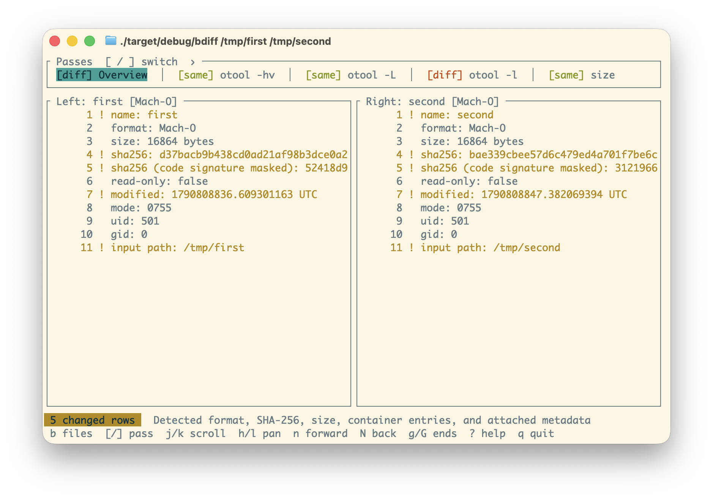
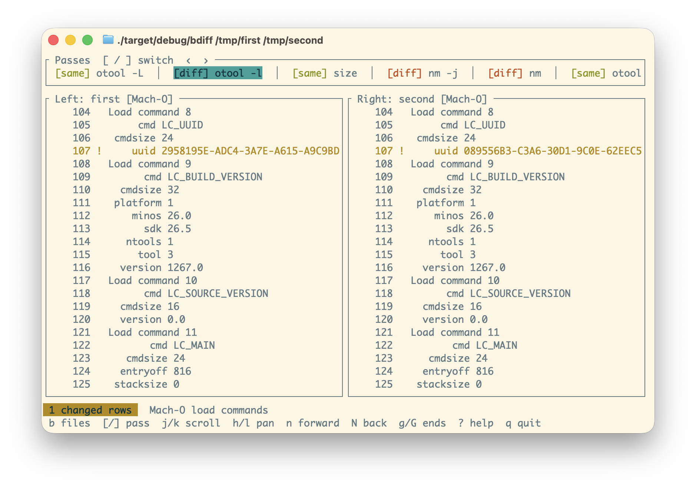

# bdiff

`bdiff` is a TUI for comparing binaries. It runs multiple tools against
both binaries and presents their output in a side-by-side diff. It
presents multiple tabs so you can see varying diffs depending on what
you're trying to compare.

It understands ELF, Mach-O, PE/COFF, regular and thin archives, and
universal Mach-O files.

Analysis tools such as `readelf` and `otool` are discovered on `$PATH`.

## Examples

[](.github/overview.png)

[](.github/otool.png)

## Installation

With Homebrew:

```sh
brew install keith/formulae/bdiff
```

With Cargo:

```sh
cargo install --locked --git https://github.com/keith/bdiff
```

Or from a local checkout:

```sh
cargo install --locked --path .
```

## Build and run

```sh
cargo build --release
./target/release/bdiff path/to/left path/to/right
```

For logs, scripts, and smoke tests, `--report` emits all applicable
comparisons without a UI:

```sh
bdiff --report old.bin new.bin
```

## Navigation

| Key | Action |
| --- | --- |
| `[` / `]` | Previous / next tab |
| `j` / `k`, arrows | Scroll down / up |
| `h` / `l`, arrows | Pan left / right |
| `PageUp` / `PageDown` | Scroll one page |
| `Ctrl-u` / `Ctrl-d` | Scroll half a page |
| `g` / `G` | Start / end |
| `n` / `N` | Next / previous change |
| `b` | Browse container members and slices |
| `?` | Help |
| `q` | Quit |

## Archives and universal Mach-O binaries

Archive and universal Mach-O binaries are treated as containers. Their
metadata is diffable but also the contained binaries and objects are
separately diffable. To select a contained binary or object, open the
file browser with `b`.
